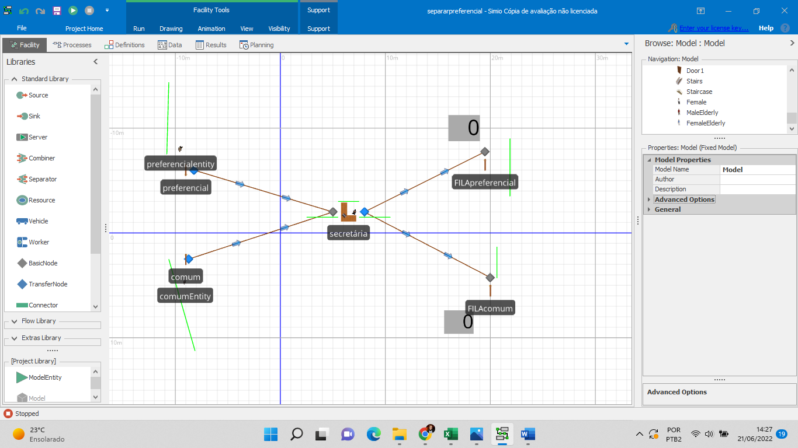
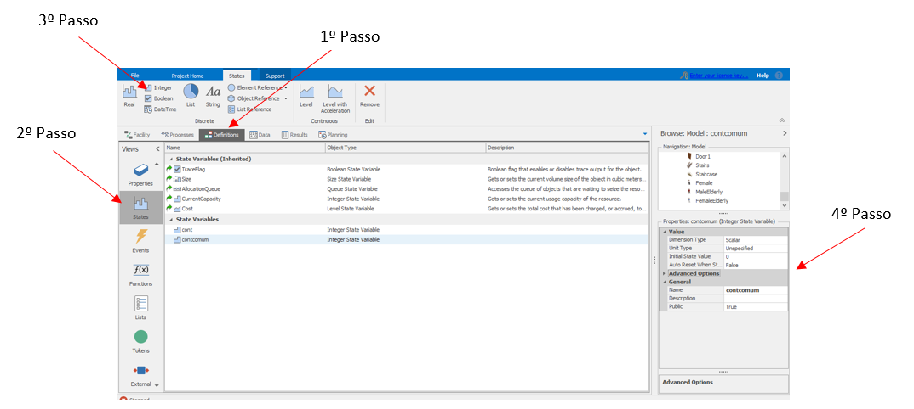
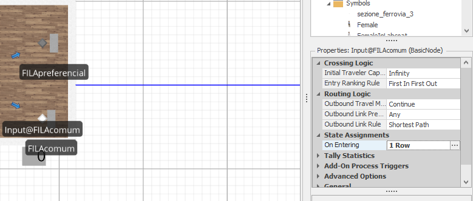
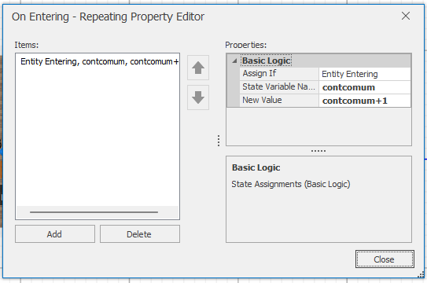
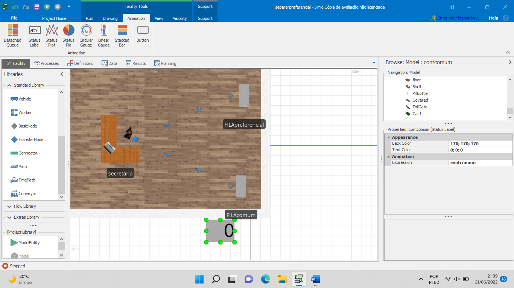

# Como adicionar um contador visual no Simio 

Os contadores podem ser adicionados em qualquer nó.

Vamos adicionar no trecho nomeado “fila comum”, para ver quantas pessoas utilizaram o caixa eletrônico. 

 

1º Passo: selecionar a aba “Definitions”
2º Passo: ir na opção “States”
3º Passo: adicionar um states integer
4º Passo: definir um nome para a estado em “Name” e colocar o número desejado como valor inicial em “Initial State Value”.

Após realizados os passos anteriores, deve-se selecionar o nó que deseja realizar a contagem de elementos que entram nele. Para isso em “State Assignments”-> “On entering” 

 
“Add” -> “Entity Entering”-> “States Variable Name”. Em “New Value” é possível definir a contagem, nesse exemplo para cada pessoa que utilizar o caixa eletrônico será acrescentado 1.

Autores: Kelly Alves de Paula

Wagner Gurgel

Revisão: Arnaldo Gunzi

Basta adicionar um “Status Label” e definir o nome da expressão que ele irá mostrar.

 

Teremos um contador visual mostrando quantas pessoas passaram pelo caixa. Vide arquivo do Simio neste repositório.

Basta adicionar um “Status Label” e definir o nome da expressão que ele irá mostrar.

 

